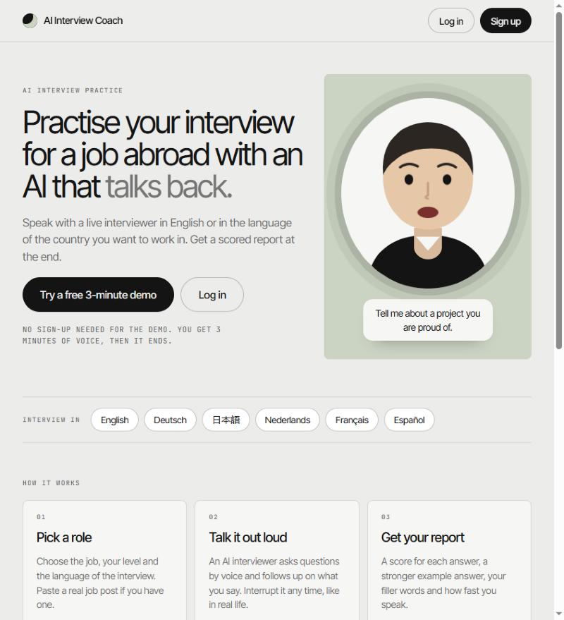
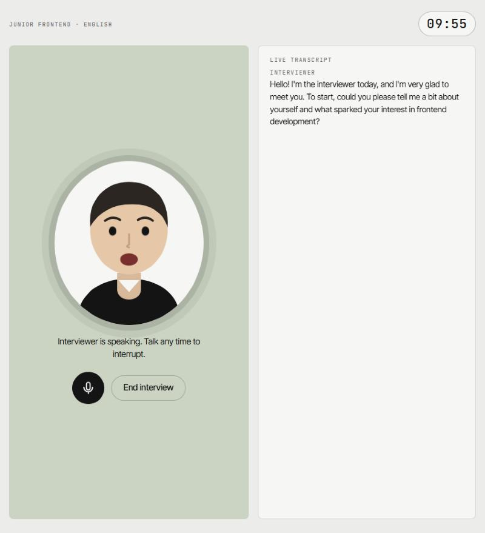
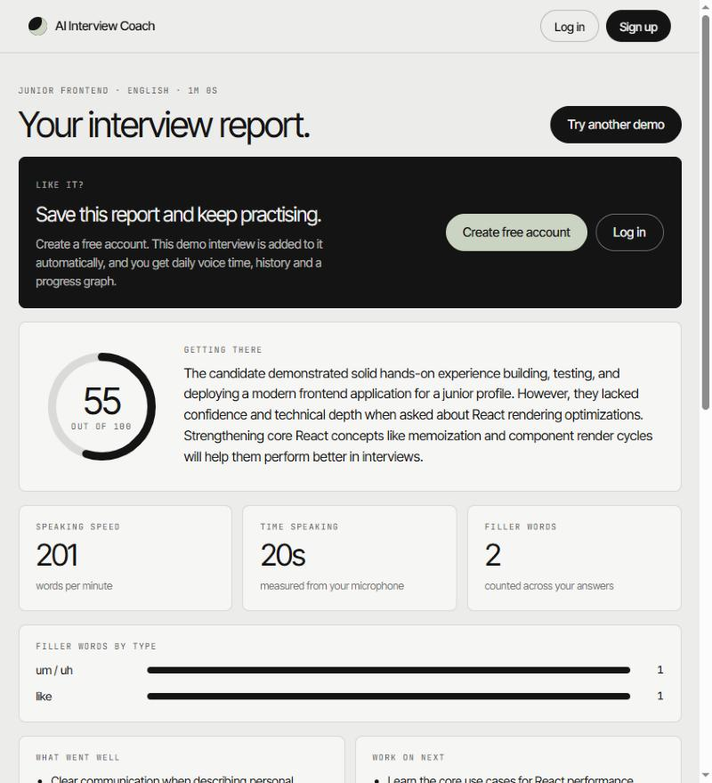
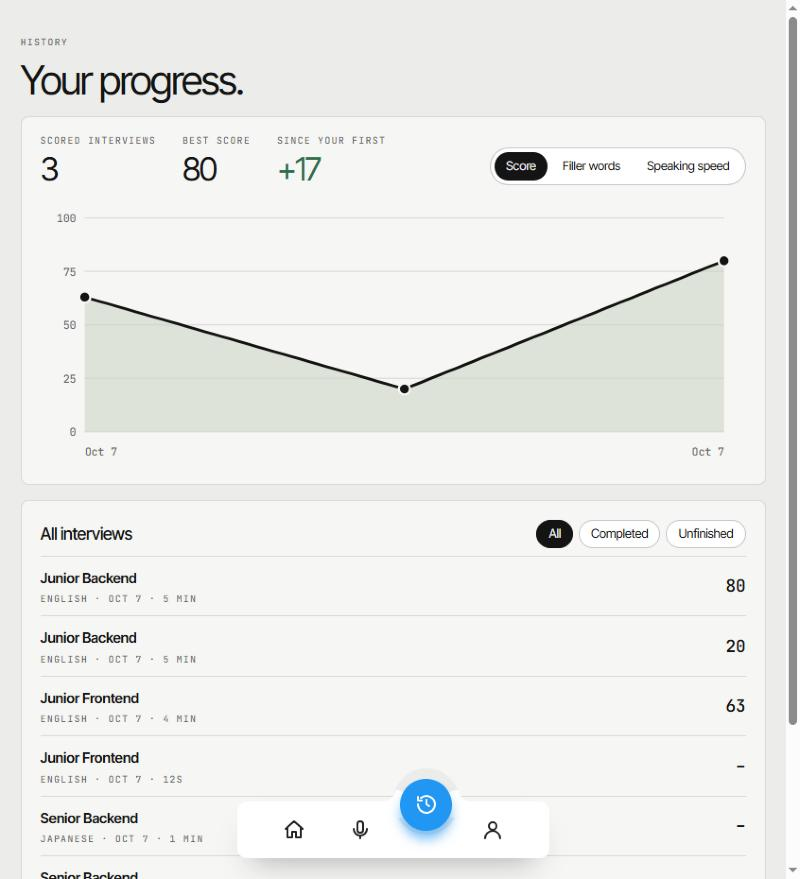
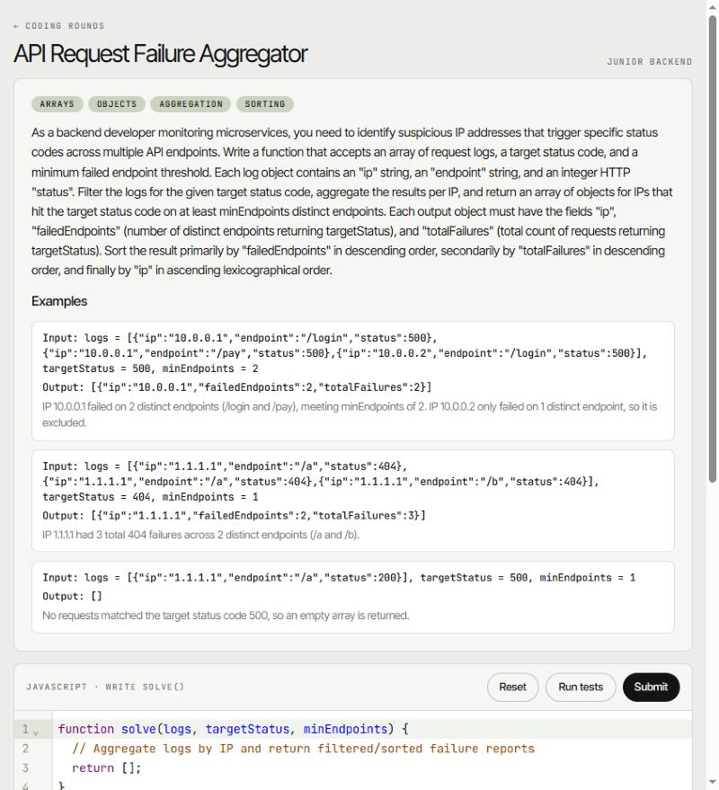

# AI Interview Coach

**Practise your interview for a job abroad with an AI that talks back.**

A live voice interviewer that speaks with you in English or in the language of the country you want to work in (German, Japanese, Dutch, French, Spanish). It asks questions for the job you pick, follows up on what you say, and gives you a scored report at the end. There is also a coding round where an AI writes the problem and you write the logic.

I built this to prepare for working abroad.

| Landing page, with a no-sign-up demo | Live voice interview |
| :---: | :---: |
|  |  |

| Scored report | Progress over time |
| :---: | :---: |
|  |  |

| Coding round: the AI sets the problem, you solve it |
| :---: |
|  |

## Features

**Voice interview**
- Pick a role (8 options), a level (Intern to Senior), a language, and optionally paste a real job post.
- The interviewer speaks out loud and you answer by voice. You can interrupt it, and it stops and listens.
- Follow-up questions are based on what you just said.
- Live transcript, a 10-minute countdown, mute button, and an animated avatar whose mouth follows the loudness of the voice, so lip movement works in every language.

**Report**
- A score out of 100, plus a score out of 10 for every answer, with feedback and a stronger example answer written in the interview language.
- Speaking speed, time spoken and filler words (um, uh, like, えーと, äh, ...) counted per language.
- Strengths and what to work on next.

**Progress**
- History page with a chart you can switch between score, filler words and speaking speed.
- Profile page with a GitHub-style activity graph (one square per day for the last year), streaks, and your target role and country.
- Dashboard with your stats and recent interviews.

**Coding round**
- The AI writes a fresh problem for your role and level, with examples and 7 to 9 tests (3 hidden). Its own reference solution must pass every test before you see the problem.
- You write the logic in a JavaScript editor and run the tests with Ctrl+Enter.
- Ask for up to 3 progressively stronger hints. A hint never gives the full solution and marks the relevant line.
- Submit for a review: score, time and space complexity, strengths, improvements and notes on specific lines.
- Both you and the AI can change the editor. Every AI change is logged and can be undone with Ctrl+Z.

**No account needed to try it**
- A 3-minute demo interview with a full report. If the visitor signs up afterwards, the demo interview is added to their account.

## How it works

```
Browser (React)                                      Gemini
  |  1. POST /api/interviews/:id/live-token             |
  |---------------------------> Express API             |
  |                              - writes the interviewer's instructions
  |                              - reserves voice time (budget check)
  |                              - creates a single-use token  ---->|
  |  <-- short-lived token (your real key stays on the server)      |
  |                                                                 |
  |  2. WebSocket, audio both ways, straight to Gemini Live API ===>|
  |     mic -> 16 kHz PCM  ...  24 kHz PCM voice <- played as it arrives
  |                                                                 |
  |  3. PUT transcript, POST finish   -> Express -> MongoDB         |
  |  4. POST report -> Express -> Gemini (text) -> scores as JSON   |
```

- The browser talks to Gemini directly for voice, so audio never waits on your server. The server only issues a token, which is single-use, locked to that interview's instructions, and expires when the reserved time runs out.
- The transcript comes from the same live session and is saved when the interview ends.
- The report is produced by a text model that returns strict JSON. Everything countable (filler words, speaking speed, the overall score) is computed in plain code, not by the AI.

## Tech stack

| Part | Tools |
| --- | --- |
| Frontend | React, Vite, TypeScript, React Router, CodeMirror 6 |
| Voice AI | Gemini Live API (real-time speech in and out) |
| Scoring and coding AI | Gemini text model with JSON schemas |
| Backend | Node.js, Express, Zod |
| Database | MongoDB (Mongoose) |
| Auth | Email and password, bcrypt, JWT in an httpOnly cookie |

## Getting started

### Prerequisites
- Node.js 20.6 or newer (the backend uses `--env-file`)
- A MongoDB database. The free tier of [MongoDB Atlas](https://www.mongodb.com/atlas) works.
- A Gemini API key from [Google AI Studio](https://aistudio.google.com). Live voice is billed by the minute, so set a spending limit on the key.

### Run it locally

```bash
git clone https://github.com/GOURAVPY/AI-Interview-Coach.git
cd AI-Interview-Coach
```

**1. Backend**

```bash
cd backend
npm install
cp .env.example .env     # then fill in MONGODB_URI, JWT_SECRET and GEMINI_API_KEY
npm run dev              # http://localhost:4000
```

**2. Frontend** (in a second terminal)

```bash
cd frontend
npm install
npm run dev              # http://localhost:5173
```

Open http://localhost:5173. The frontend proxies `/api` to the backend, so cookies work without extra CORS setup.

> Use headphones when trying the voice interview, so the interviewer does not hear itself. The browser will ask for microphone permission.

### Environment variables

All of these live in `backend/.env` (see [`backend/.env.example`](backend/.env.example)).

| Variable | What it does |
| --- | --- |
| `MONGODB_URI` | Your MongoDB connection string. **Required.** |
| `JWT_SECRET` | A long random string for login sessions. **Required.** |
| `GEMINI_API_KEY` | Your Gemini key. Needed for voice, reports and the coding round. |
| `PORT`, `CLIENT_ORIGIN` | Server port and the frontend address (for CORS). |
| `TRUST_PROXY` | Set to `1` behind a reverse proxy so the per-network demo limit sees real visitor addresses. |
| `GEMINI_LIVE_MODEL`, `GEMINI_SCORING_MODEL` | Optional model overrides. |
| `USER_DAILY_VOICE_MINUTES` | Voice minutes per signed-in user per day. Default 30. |
| `GLOBAL_MONTHLY_VOICE_MINUTES` | Voice minutes across all users per month. Default 600. **Set this to what your bill can bear.** |
| `DEMO_SECONDS_PER_VISITOR`, `DEMO_NETWORK_DAILY_SECONDS` | Demo limits: seconds per visitor (default 180) and per network per day (default 600). |

## Project structure

```
backend/src
  config/        env and database setup, allowed roles, levels and languages
  controllers/   request handlers: auth, interviews, coding rounds
  middleware/    login check, demo visitor cookie, error handling
  models/        User, Interview, CodingSession, Usage (voice-time counters)
  prompts/       the interviewer's instructions, the scoring guide, coding prompts
  routes/        /api/auth, /api/interviews, /api/demo, /api/coding, /api/usage
  services/      Gemini tokens, scoring, speech metrics, voice-time budget, sandbox
frontend/src
  components/    avatar, code editor, chart, activity graph, nav bar, layouts
  hooks/         useLiveInterview (mic, WebSocket, playback, transcript, timer)
  pages/         landing, demo, dashboard, practice, interview room, report,
                 history, profile, coding setup and coding room
  utils/         audio helpers and the sandboxed test runner
docs/screenshots
```

## How scores stay fair

- The scoring model gets a fixed written guide: four criteria (relevance, depth, structure, correctness) and anchored levels from 1 to 10, judged against the level you picked. It is told not to inflate, and most real answers land between 4 and 7.
- It runs at temperature 0 and must return JSON that is validated before it is saved. Scoring the same transcript twice gave identical scores.
- The overall score is the average of the answer scores, calculated by code.
- The transcript and job post are treated as data. Instructions hidden inside them are ignored.

## Cost control and security

- **Voice time is capped** per user per day, per demo visitor, per network per day and across everyone per month. Time is reserved before a session starts and the unused part is refunded when it ends, measured on the server's clock. If someone closes the tab, the full reservation stays charged, so the cap never under-counts.
- **Your Gemini key never reaches the browser.** The browser only gets a single-use token.
- Passwords are hashed with bcrypt, sessions use an httpOnly cookie, login attempts and expensive endpoints are rate limited, and every interview is only readable by its owner.
- **Coding rounds:** your code runs only in your own browser, in a throwaway Web Worker with a 3-second limit. The server only runs the AI's own reference solution, in a separate thread with time and memory limits.

## Status and limitations

Working today: login, demo, dashboard, voice interview, report, history, profile and the coding round.

Known limitations:
- Voice has been tested end to end in a desktop browser. Behaviour with different microphones, echo, and phone browsers still needs more testing.
- Only the English and Japanese filler-word detection has been checked against real transcripts. The other languages use word lists that have not been verified.
- The AI's feedback and code reviews can be imperfect. Treat them as a mentor's opinion.
- Coding rounds are JavaScript only and do not appear in History or the profile graph yet.
- There are no automated tests yet.

Planned:
- Interview styles by country (US startup, UK, German, Japanese)
- Eye-contact tips from the webcam, processed only in the browser
- A result card to share on LinkedIn
- A 3D avatar with lip sync (TalkingHead)
